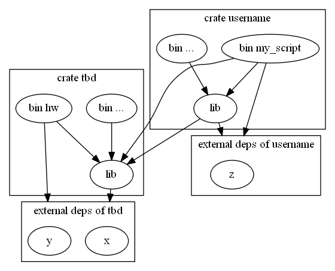

### Environment

Let's say relatively recent nightly toolchain.
OS is not important, this should work on any major one.

### packages != compilation units != modules != files

(The following is oversimplification and lies but this shit is confusing as it is already.)

Package is a thing with `Cargo.toml`. It's a unit of dependency management.

A package contains exactly one lib compilation unit and any number of bin compilation units.

By the way, Rust docs and compiler messages use the word "crate" to refer to packages and compilation units, depending on the context.

Lib compilation unit is a tree of modules with the root at `src/lib.rs`.
This tree structure could be defined either inline, or in separate files. Or any combination.
```rust
// src/lib.rs
root stuff
mod my_module {
    my_module stuff
    mod my_submodule {
        my_submodule stuff
    }
}
```
This is the same module structure as
```rust
// src/lib.rs
mod my_module;
root stuff

// src/my_module.rs
mod my_submodule;
my_module stuff

// src/my_module/my_submodule.rs
my_submodule stuff
```

Module hierarchy is important for visibility: a submodule has access to the private stuff of its parent module. Aside from that, modules are kind a like namespaces.

Bin compilation unit is a single file like `src/bin/my_executable.rs`.

### Dependencies

Dependencies are declared at the level of packages ("package A depends on package B").

In terms of compilation units:

 * bin compilation units can use stuff from the lib compilation unit of their package
 * bin and lib compilation units in package A can use stuff from the lib compilation unit in package B
 * stuff defined in bin compilation units can't be used in other compilation units

### Project structure

```
Cargo.toml              <-- package "tbd"
src/
  lib.rs                <-\
  module1.rs            <-|- lib compilation unit "tbd"
  module2.rs            <-/
  bin
    hw.rs               <-- bin compilation unit "hw"
scratches/
  username/
    Cargo.toml          <-- package "username"
    src/
      lib.rs            <-- lib compilation unit "username"
      bin/
        my_script.rs    <-- bin compilation unit "my_script"
```

Package "tbd" is what we used to call "production".

Package "username" declares "tbd" as an external dependency.

Compilation units and what they can use:
<!--
To update, run
    dot compilation_units.dot -Tpng -o compilation_units.png
-->


### How to run

```
cargo test              # run all tests in package "tbd"
cargo test -p username  # run all tests in package "username"
cargo test --all        # run all tests in all our packages
cargo run --bin hw      # run hw.rs in package "tbd"
cargo run -p username --bin my_script   # run my_script.rs in package "username"
```

### Data directories

 * `data/`: For stuff like examples from the problem statement.
   Everything here is under version control.
   Maybe don't commit tons of generated files here without a good reason.
 * `outputs/`: For logs, images rendered by visualizers, etc.
   In other word, stuff produced by machines for humans.
   Not under version control.
 * `cache/`: This directory is for generated files that could be helpful to have around,
   but should be safe to delete at any time (they should be regenerated if needed).
   Not under version control.

By the way, there is an utility function:
`project_path("data/zzz")` returns absolute path to this file
independently of the current directory.