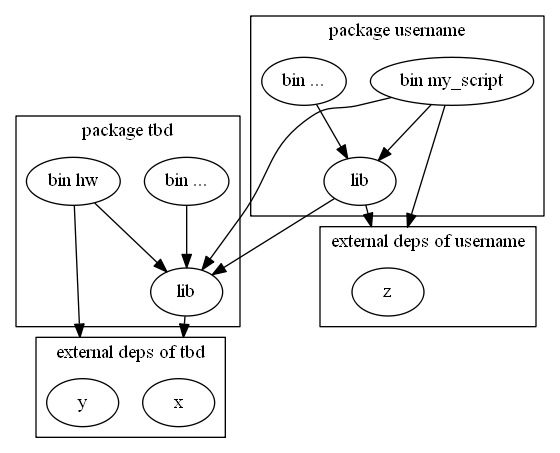

### Environment

Let's say relatively recent nightly toolchain.
OS is not important, this should work on any major one.

### crates != compilation units != modules != files

(The following is oversimplification and lies but this shit is confusing as it is already.)

Crate is a thing with `Cargo.toml`. It's a unit of dependency management.

A crate contains exactly one lib compilation unit and any number of bin compilation units.

Lib compilation unit is a tree of modules with the root at `src/lib.rs`.
This tree structure could be defined either inline, or in separate files. Or any combination.
```rust
// src/lib.rs
root stuff
mod my_module {
    my_module stuff
    mod my_submodule {
        my_submodule stuff
    }
}
```
This is the same module structure as
```rust
// src/lib.rs
mod my_module;
root stuff

// src/my_module.rs
mod my_submodule;
my_module stuff

// src/my_module/my_submodule.rs
my_submodule stuff
```

Module hierarchy is important for visibility: a submodule has access to the private stuff of its parent module. Aside from that, modules are kind a like namespaces.

Bin compilation unit is a single file like `src/bin/my_executable.rs`.

### Dependencies

Dependencies are declared at the level of crates ("crate A depends on crate B").

In terms of compilation units:

 * bin compilation units can use stuff from the lib compilation unit of their crate
 * bin and lib compilation units in crate A can use stuff from the lib compilation unit in crate B
 * stuff defined in bin compilation units can't be used in other compilation units

### Project structure

```
Cargo.toml              <-- crate "tbd"
src/
  lib.rs                <-\
  module1.rs            <-|- lib compilation unit "tbd"
  module2.rs            <-/
  bin
    hw.rs               <-- bin compilation unit "hw"
scratches/
  username/
    Cargo.toml          <-- crate "username"
    src/
      lib.rs            <-- lib compilation unit "username"
      bin/
        my_script.rs    <-- bin compilation unit "my_script"
```

Crate "tbd" is what we used to call "production".

Crate "username" declares "tbd" as an external dependency.

Compilation units and what they can use:
<!--
To update, run
    dot compilation_untis.dot -Tpng -o compilation_units.png
-->


### How to run

```
cargo test              # run all tests in crate "tbd"
cargo test -p username  # run all tests in crate "username"
cargo test --all        # run all tests in all our crates
cargo run --bin hw      # run hw.rs in crate "tbd"
cargo run -p username --bin my_script   # run my_script.rs in crate "username"
```
